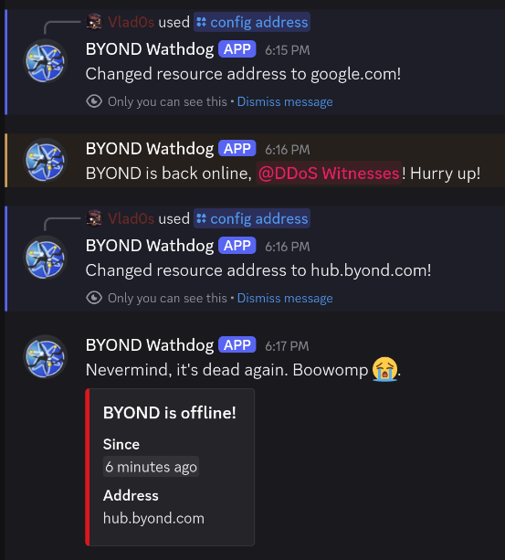

# discord-watchdog

A relatively simple Discord bot that notifies users when an internet resource becomes accessible or inaccessible.

It uses:
- [poise](https://github.com/serenity-rs/poise/) as its bot framework  
- [surge-ping](https://github.com/kolapapa/surge-ping) for ICMP pings  

The watchdog pings the selected resource at regular intervals. If the resource becomes available after an outage, the bot notifies a specified Discord role.

Originally created to monitor the [BYOND](https://www.byond.com/) Hub during persistent DDoS attacks, the bot is configured to:
- Ping users when the resource comes back online  
- Only send a silent notification (no ping) when the resource goes down  

To modify this behavior (e.g., to ping users during outages), you'll need to adjust the code.

## Screenshots

## Config

Configuration is managed via `Config.toml` in the bot's executable directory. See `Config.example.toml` for reference syntax.

> [!IMPORTANT]  
> After the first launch, the bot creates `Data.toml` to store runtime configuration.
> Subsequent starts will ignore `Config.toml` unless you either:  
> 1. Delete `Data.toml`, **or**  
> 2. Run the `config reset` command  

## Commands

All slash commands except `info` require `MENTION_EVERYONE` (empirical choice) permissions:

| Command | Description |
|---------|-------------|
| `config reset` | Restores configuration to `Config.toml` defaults (or hardcoded defaults if absent) |
| `config name` | Changes the monitored resource's name |
| `config address` | Updates the monitored resource's address |
| `config channel` | Changes the notification channel |
| `config role` | Modifies the role pinged when the resource recovers |
| `config interval` | Adjusts the delay between ping attempts |
| `config timeout` | Changes the ping attempt timeout duration |
| `debug logs` | Sends ephemeral `debug.log` |
| `debug data` | Sends ephemeral `Data.toml` |
| `info` | Displays information about the bot |

## Installation

### From Releases
1. Download the latest release archive from GitHub.
2. Extract the files to your preferred location.
3. Create an application on the [Discord Developer Portal](https://discord.com/developers). Customize the name, description, etc., if necessary ([Image](images/application.png)).
4. Create a bot for this application and get your bot's `Token`. It may be displayed already, or you may need to press the **Reset Token** button ([Image](images/bot.png)).
5. Select the `Manage Messages` and `Send Messages` permissions for your bot ([Image](images/permissions.png)).
6. Set your `Token` as `DISCORD_TOKEN` in `.env`. Consider setting `INTERACTIVE` in `.env` to `0`, if you are running this bot on a server.
7. Customize `Config.toml` as needed.
8. Add your bot to your Discord server.
9. Run the executable.

### From Source
1. Clone the repository from GitHub.
2. Ensure you have [Cargo and Rust](https://www.rust-lang.org/tools/install) installed.
3. Build the source code using `cargo build --release`.
4. Move the executable from `./target/release` to your desired location.
5. Create an application on the [Discord Developer Portal](https://discord.com/developers). Customize the name, description, etc., if necessary ([Image](images/application.png)).
6. Create a bot for this application and get your bot's `Token`. It may be displayed already, or you may need to press the **Reset Token** button ([Image](images/bot.png)).
7. Select the `Manage Messages` and `Send Messages` permissions for your bot ([Image](images/permissions.png)).
8. Copy `Config.example.toml` to the same location, rename it to `Config.toml`, and customize it as needed.
9. Copy `.env.example` to the same location, rename it to `.env`. Set your `Token` as `DISCORD_TOKEN` in `.env`. Consider setting `INTERACTIVE` in `.env` to `0`, if you are running this bot on a server.
10. Add your bot to your Discord server.
11. Run the executable.

> [!TIP]
> All logs are written to both standard output and `./debug.log`. For more detailed ping request information, set `TRACING = 1` in your `.env` file to log every ping attempt. Careful: These logs can grow large quickly!

## License

Licensed under either of **[Apache License, Version 2.0](LICENSE-APACHE)** or **[MIT license](LICENSE-MIT)** at your option.

Unless you explicitly state otherwise, any contribution intentionally submitted for inclusion in this crate by you, as defined in the Apache-2.0 license, shall be dual licensed as above, without any additional terms or conditions.

*Not affiliated with BYOND or Discord. All trademarks belong to their respective owners.*